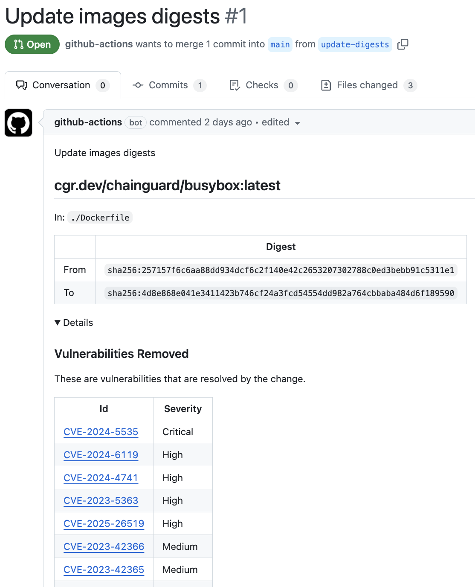
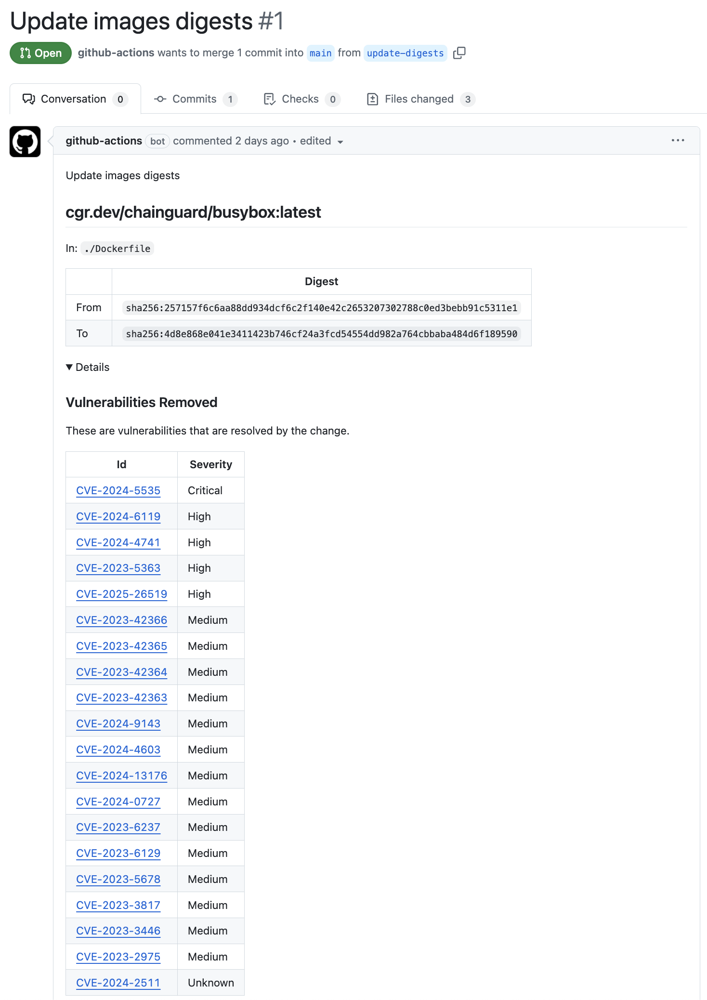

# digestabot-diff

This action extends
[`chainguard-dev/digestabot`](https://github.com/chainguard-dev/digestabot),
adding information about what has changed in a given image update.

It uses [`grype`](https://github.com/anchore/grype) to identify what
vulnerabilities have been added or removed.




## Usage

```
- uses: ribbybibby/digestabot-diff@main
  with:
    token: ${{ secrets.GITHUB_TOKEN }}
```

## Scenarios

Here's a full example.

```yaml
name: Image digest update

on:
  workflow_dispatch:
  schedule:
    # At the end of every day
    - cron: "0 0 * * *"

jobs:
  image-update:
    name: Image digest update
    runs-on: ubuntu-latest

    permissions:
      contents: write # to push the updates
      pull-requests: write # to open Pull requests
      id-token: write # used to sign the commits using gitsign

    steps:
    - uses: actions/checkout@v4

    - uses: ribbybibby/digestabot-diff@main
      with:
        token: ${{ secrets.GITHUB_TOKEN }}
        signoff: true # optional
        author: ${{ github.actor }} <${{ github.actor_id }}+${{ github.actor }}@users.noreply.github.com> # optional
        committer: github-actions[bot] <41898282+github-actions[bot]@users.noreply.github.com> # optional
        labels-for-pr: automated pr, kind/cleanup, release-note-none # optional
        branch-for-pr: update-digests # optional
        title-for-pr: Update images digests # optional
        description-for-pr: Update images digests # optional
        commit-message: Update images digests # optional
```
Only perform an update if the new image removes vulnerabilities. This can help
reduce the toil of reviewing PRs for tags that are frequently updated.

```
- uses: ribbybibby/digestabot-diff@main
  with:
    token: ${{ secrets.GITHUB_TOKEN }}
    only-removed-vulnerabilities: true
```
